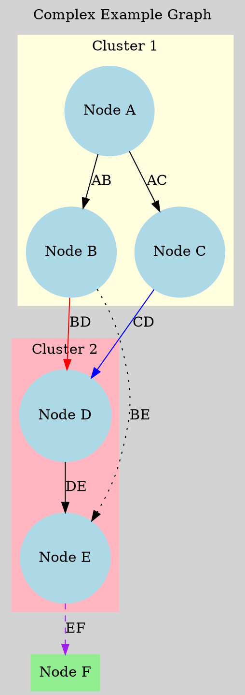

WARNING: this library comes without any warranty. Use at your own risk.

# My Docs


```dot
digraph G {
    // Graph attributes
    bgcolor = "lightgray"
    label = "Complex Example Graph"
    labelloc = "t"
    labeljust = "c"

    // Node attributes
    node [shape=circle, style=filled, color=lightblue, fontcolor=black];

    // Define subgraphs (clusters)
    subgraph cluster_1 {
        label = "Cluster 1"
        style = filled;
        color = "lightyellow";

        A [label="Node A"];
        B [label="Node B"];
        C [label="Node C"];
    }

    subgraph cluster_2 {
        label = "Cluster 2"
        style = filled;
        color = "lightpink";

        D [label="Node D"];
        E [label="Node E"] ;
    }

    // Additional nodes
    F [label="Node F", shape=rect, color=lightgreen];

    // Edges between nodes
    A -> B [label="AB"];
    A -> C [label="AC"];
    B -> D [label="BD", color="red"];
    C -> D [label="CD", color="blue"];
    D -> E [label="DE"];
    E -> F [label="EF", color="purple", style=dashed];

    // Cross-cluster connections
    B -> E [label="BE", style=dotted];
}

```


```asciinema-player
{
    "file": "assets/asciinema/bootstrap.cast"
}
```